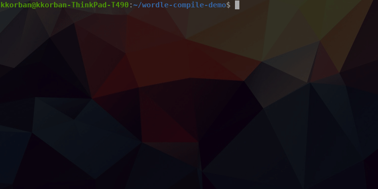

## Scala 3 Wordle compile

A Scala 3 compiler plugin, that requires you to solve a Wordle in order for the compilation to finish.

### Demo



### Running locally

```
sbt package
```

```
scala3 -Xplugin:path_to_pluginjar.jar file.scala
```

Default jar location after `sbt package`: `location_of_wordle-compile/target/scala-3.1.1/wordle-compile_3-0.1.0-SNAPSHOT.jar`

Obviously inspired by [Wordle](https://www.nytimes.com/games/wordle/index.html).

### Running locally (sbt)

```
sbt publishLocal
```

Add the following lines to sbt config (build.sbt):
```
autoCompilerPlugins := true

addCompilerPlugin("dev.korban" %% "wordle-compile" % "0.1.0-SNAPSHOT")
```
